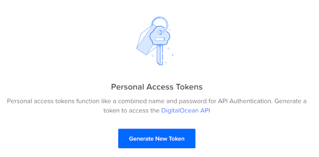
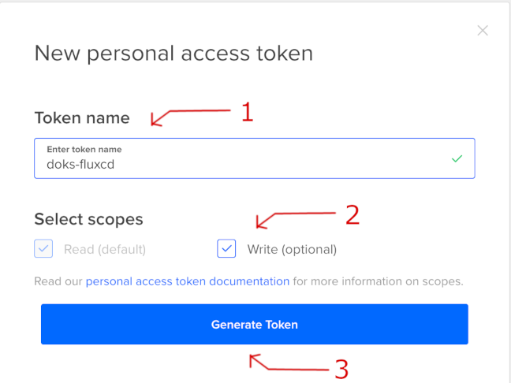
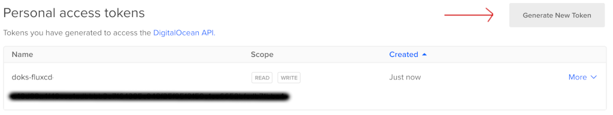
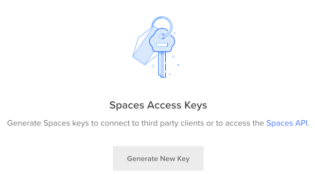
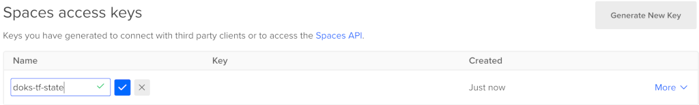
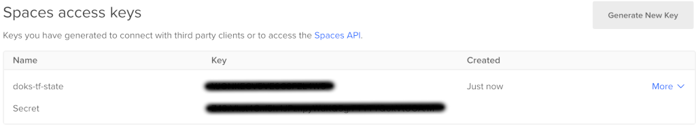
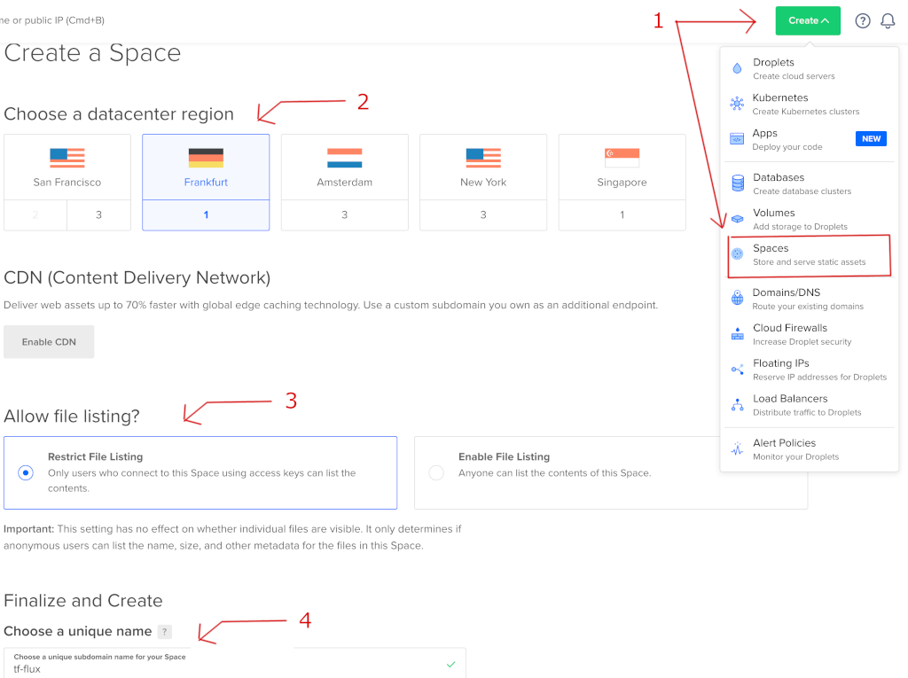
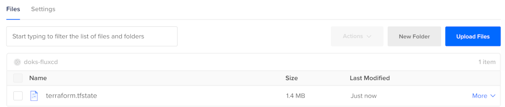

# Gitops via DOKS and Flux CD

This blueprint will guide you step by step on how to spin up a DOKS (DigitalOcean Kubernetes) cluster and Flux CD for managing application deployments in a GitOps fashion.

[Terraform](https://www.terraform.io) was chosen to write `infrastructure as code` using declarative configuration files which allows for concise descriptions of resources using blocks, arguments, and expressions. In our guide it will be responsible with spinning up the DOKS (DigitalOcean Kubernetes) cluster as well as [Flux CD](https://fluxcd.io).

[Flux CD](https://fluxcd.io) is used for managing the `Continuous Delivery` of applications inside the DigitalOcean Kubernetes cluster as well as a `Gitops` enabler.


## Bootstrapping DOKS and Flux CD

This section contains information about how we can bootstrap **DOKS** and **Flux CD** via **Terraform** using **Github** as a SCM provider and source of truth.

### Requirements:

1. A DigitalOcean [account](https://cloud.digitalocean.com) is required in order to create the access keys and provision the DOKS cluster.
2. Next a [Github](https://github.com/) account is needed.
3. A git client has to be installed as well depending on the distro.
  
    E.g.: on MacOS it can be installed via Homebrew:
    ```bash
    brew info git
    brew install git
    ```

4. [Terraform](https://www.terraform.io/downloads.html) must be installed next. 
    
    E.g.: on MacOS it can be installed via Homebrew:
    ```bash
    brew info terraform
    brew install terraform
    ```

### Installation steps

1. Start by creating a [Github personal access token](https://github.com/settings/tokens) that has the `repo` permissions set. Copy the token value and save it in a local environment variable as we will need it later on. While we're at this step we're going to fill in some other required details like the owner, the name and the path in the git repository where Flux CD manifests will be created (make sure to replace the `<>` placeholders accordingly):

    ```bash
    export TF_VAR_github_owner="<github_owner>"
    export TF_VAR_github_token="<github_personal_access_token>"
    export TF_VAR_github_repository_name="<git_repository_name>"
    export TF_VAR_github_repository_target_path="<flux_cd_sync_target_path>"
    ```
2. Let's go next with setting up the required stuff on the [DigitalOcean](https://cloud.digitalocean.com) side by creating the necessary tokens first. One is needed for creating/managing the DOKS cluster and another one for [DO Spaces](https://cloud.digitalocean.com/spaces) (similar to AWS S3). The latter is needed for storing the Terraform state file.

    From your DigitalOcean account go to the [API](https://cloud.digitalocean.com/account/api) section in order to generate the tokens. 
    
    Create a personal access token first by clicking the `Generate New Token` button:

    

    then make sure to give it a proper name and that the `Write` scope is checked:

    

    In the end we should have something like this:

    

    Copy the token value and save it in a local environment variable as we will need it later on (make sure to replace the `<>` placeholder):

    ```bash
    export TF_VAR_do_token="<your_do_personal_access_token>"
    ```
    Next we navigate to `Spaces access keys` and click the `Generate New Key` button:

    

    then give it a proper name and mark it as done:

    

    In the end we should have something like this:

    

    Copy the key and secret value and save each in a local environment variable for later use (make sure to replace the `<>` placeholder):

    ```bash
    export DO_SPACES_ACCESS_KEY="<your_do_spaces_access_key>"
    export DO_SPACES_SECRET_KEY="<your_do_spaces_secret_key>"
    ```
3. Going further we have to create a [DO Space](https://cloud.digitalocean.com/spaces) for storing the Terraform state file. Go ahead to your DigitalOcean account panel and click on the `Create` button (the green one) from the upper right corner. Select a region closer to you then make sure that `Restrict file listing` is checked and finally give it a proper name. The required steps are highlighted below:

    
4. Clone this repository on your local machine and navigate to the appropriate directory:
   
    ```bash
    git clone https://github.com/digitalocean/container-blueprints.git
    cd create-doks-with-terraform-flux
    ```
5. Terraform initialization must be perfomed next. A [DO Spaces](https://cloud.digitalocean.com/spaces) bucket for storing the Terraform state file is highly recommended because we do not have to worrry about exposing sensitive data as long as the space is private of course. Another advantage is that the state of our infrastructure is backed up so we can re-use it in order to do a refresh and change only the affected parts which is a great and powerful feature of Terraform in the end. Having a common shared space across more team members is desired as well in order to perform collaborative work via Terraform.
   
    The [backend.tf](backend.tf) file must be reviewed and modified accordingly first in order to provide the appropriate values for `endpoint`, `region`, `bucket` and `key` (explanations for each can be found inside).

    Let's initialize the backend now using the previously created `access` and `secret` keys for the [DO Spaces](https://cloud.digitalocean.com/spaces):
   
    ```bash
    terraform init  --backend-config="access_key=$DO_SPACES_ACCESS_KEY" --backend-config="secret_key=$DO_SPACES_SECRET_KEY"
    ```

    Sample output:
    ```
    Initializing the backend...

    Successfully configured the backend "s3"! Terraform will automatically
    use this backend unless the backend configuration changes.

    Initializing provider plugins...
    - Finding hashicorp/kubernetes versions matching "2.3.2"...
    - Finding gavinbunney/kubectl versions matching "1.11.2"...
    ...
    ```
6. Going furher let's create a `plan` in order to inspect the infrastructure changes:

    ```bash
    terraform plan
    ```
7. If everything seems alright then `apply` the changes with: 
   
    ```bash
    terraform apply
    ```

    Sample output:
    ```
    tls_private_key.main: Creating...
    kubernetes_namespace.flux_system: Creating...
    github_repository.main: Creating...
    tls_private_key.main: Creation complete after 2s [id=1d5ddec06b0f4daeea57d3a987029c1153ebcb21]
    kubernetes_namespace.flux_system: Creation complete after 2s [id=flux-system]
    kubectl_manifest.install["v1/serviceaccount/flux-system/source-controller"]: Creating...
    kubectl_manifest.sync["kustomize.toolkit.fluxcd.io/v1beta1/kustomization/flux-system/flux-system"]: Creating...
    kubectl_manifest.install["v1/serviceaccount/flux-system/helm-controller"]: Creating...
    kubectl_manifest.install["networking.k8s.io/v1/networkpolicy/flux-system/allow-egress"]: Creating...
    ...
    ```

    If everything goes well the [DOKS cluster](https://cloud.digitalocean.com/kubernetes/clusters) should be up and running as well as Flux CD. The terraform state file should be saved in your [DO Spaces](https://cloud.digitalocean.com/spaces) bucket so please go ahead and check it. It should look similar as seen in the picture down below:

    


## Overriding default variables for Terraform

If some of the default values used by the Terraform module provided in this repository need to be modified then a `project.tfvars` file needs to be created (this **must not** be commited in git as it may contain sensitive data - the `.gitignore` is already set to ignore this kind of file).

There's a [project.tfvars.sample](project.tfvars.sample) file provided in this repo so we can just rename it:

```bash
cp project.tfvars.sample project.tfvars
```
And then fill in the right values for the project ([variables.tf](variables.tf) contains the description for each variable).

Now we're going to use this file to provide the required input variables as seen below:

```bash
terraform plan -var-file="project.tfvars"
terraform apply -var-file="project.tfvars"
```

## Inspecting the cluster and applications state
In order to inspect the Kubernetes cluster as well as the Flux CD state and getting information about various components we need to install a few tools like:

1. `doctl` for DigitalOcean interaction (most of the tasks that can be done via the DO account web interface can be accomplished using the CLI version as well) 
2. `kubectl` for Kubernetes interaction
3. `flux` for Flux CD interaction

### Doctl

Can be installed for your specific OS and architecture from [here](https://github.com/digitalocean/doctl/releases). On MacOS we can use Homebrew to install it very easily like this:

```bash
brew info doctl
brew install doctl
```

After installation we have to initialize it using the DigitalOcean personal token created at the beginning of this blueprint (when asked just paste it):

```bash
doctl auth init
```

Verify that the new auth context was added with:

```bash
doctl auth list
```

### Kubectl

Please follow the specific steps for your OS and architecture from the official [site](https://kubernetes.io/docs/tasks/tools). On MacOS we can use Homebrew to install it very easily like this:

```bash
brew info kubectl
brew install kubectl
```

Next we have to set kubectl context to point to our cluster created in this blueprint like this:

```bash
doctl k8s cluster kubeconfig save <doks_cluster_name>
```

Where `<doks_cluster_name>` must be replaced with the name given to the cluster in the `project.tfvars` file created in this blueprint (the variable is `doks_cluster_name`).

Next check that the context was set and it's pointing to your Kubernetes cluster by running:

```bash
kubectl config get-contexts
```

### Flux

This is the CLI tool used by Flux to provision it as well as interact with it. Can be installed from the [official](https://fluxcd.io/docs/installation) site following the steps specific for your OS.

After installation and if all the above steps for doctl and kubectl were completed successfully we can check flux status with:

```bash
flux check
```
Sample output:

```
► checking prerequisites
✔ kubectl 1.21.3 >=1.18.0-0
✔ Kubernetes 1.21.2 >=1.16.0-0
► checking controllers
✗ helm-controller: deployment not ready
► ghcr.io/fluxcd/helm-controller:v0.11.1
✔ kustomize-controller: deployment ready
► ghcr.io/fluxcd/kustomize-controller:v0.13.1
✔ notification-controller: deployment ready
► ghcr.io/fluxcd/notification-controller:v0.15.0
✔ source-controller: deployment ready
► ghcr.io/fluxcd/source-controller:v0.15.3
✔ all checks passed
```

Inspect all resources with:

```bash
flux get all
```

Sample output:

```
NAME                     	READY	MESSAGE                                                        	REVISION                                     	SUSPENDED 
gitrepository/flux-system	True 	Fetched revision: main/1d69c3c9591e18a68d5794c2d21d4b31c3398ac6	main/1d69c3c9591e18a68d5794c2d21d4b31c3398ac6	False    	

NAME                     	READY	MESSAGE                                                        	REVISION                                     	SUSPENDED 
kustomization/flux-system	True 	Applied revision: main/1d69c3c9591e18a68d5794c2d21d4b31c3398ac6	main/1d69c3c9591e18a68d5794c2d21d4b31c3398ac6	False  
```

In case we need to do some troubleshooting and also see what Flux CD is doing we can access the logs via:

```bash
flux logs
```

Sample output:

```
...
2021-07-20T12:31:36.696Z info GitRepository/flux-system.flux-system - Reconciliation finished in 1.193290329s, next run in 1m0s 
2021-07-20T12:32:37.873Z info GitRepository/flux-system.flux-system - Reconciliation finished in 1.176637507s, next run in 1m0s 
...
```